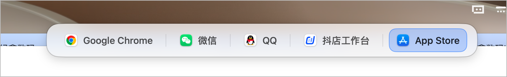
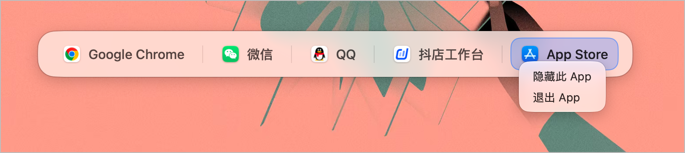
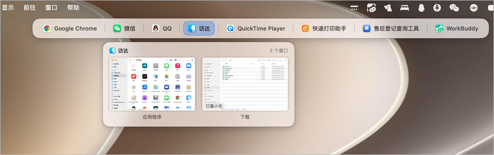
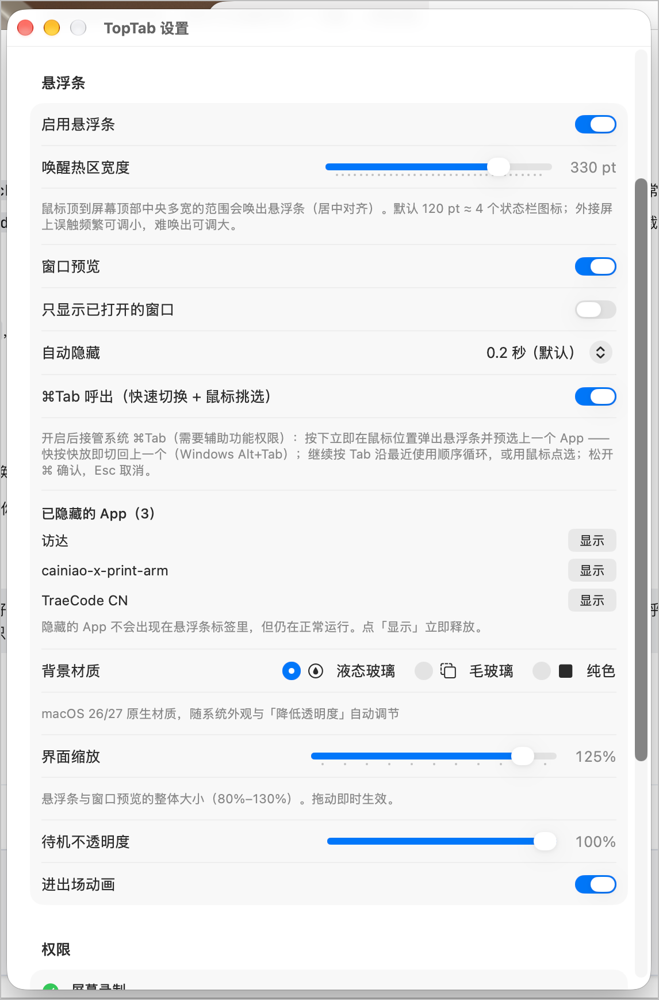

# TopTab

屏幕顶部的悬浮 App 切换条。默认藏起来不挡视线，鼠标顶到屏幕顶部唤出；液态玻璃背景、自动分类运行中的 App、图标 + 名称、单击切换并置前、悬停弹出窗口缩略图。菜单栏有图标，带完整设置窗口。

## 新增

| 功能 | 说明 |
|---|---|
| **界面缩放** | 设置 → 悬浮条 → 界面缩放，80%–130%，拖动即时生效。悬浮条与窗口预览等比放大，命中区域同步缩放，适配不同分辨率的屏幕和外接显示器 |
| **标签右键 隐藏 / 退出** | 标签上右键 →「隐藏此 App」/「退出 App」。隐藏的 App 不再占标签位、也不再出现在悬停预览里，但仍在后台正常运行 —— 只留自己每天高频切换的那几个，列表短了切换更快；想放回来去设置 →「已隐藏的 App」点「显示」 |
| **⌘Tab 呼出** | 按下 ⌘Tab 在**鼠标位置**弹出悬浮条并预选上一个 App：快按快放 = 立刻切回上一个（复刻 Windows Alt+Tab）；按住不放继续按 Tab 沿最近使用顺序循环，也可以直接用鼠标点选；松开 ⌘ 确认，Esc 取消 |

## 交互

| 操作 | 结果 |
|---|---|
| 鼠标移到屏幕**顶部中央**（菜单栏区域） | 唤出切换条 |
| 鼠标离开条和顶部区域 0.2 秒 | 自动隐藏（可改 0.2 / 0.4 / 0.8 / 1.5 / 3 / 4 秒或常驻） |
| 单击 App 标签 | 该 App 切到前台（等价于点 Dock 图标），高亮立刻跟到新标签 |
| 指针进入唤出区 / 标签条 / 离开 | 亮起 / 保持 / 撤下当前前台 App 的蓝色高亮 |
| 悬停 App 标签 0.12 秒 | 下方弹出该 App 的窗口缩略图（**仅当该 App 有 ≥2 个窗口**；单窗口点标签即切换，预览是打扰） |
| 鼠标扫过缩略图 | 卡片浮起 + 强调色描边 + 标题转深，明确指示当前指着哪一张 |
| 按住缩略图 | 卡片缩到 0.955、边框加粗；**松手才执行**，中途拖出去即取消 |
| 单击缩略图 | 精确切到那一个窗口（先回弹确认再切），最小化的会先恢复（需辅助功能权限） |
| 单击缩略图**左上角 ×** | 关掉那个窗口（等价于点它的红色关闭按钮，不碰别的窗口） |
| 条上**右键** | 设置 / 自动隐藏 / 预览开关 / 权限 / 刷新 / 退出 |
| **标签上右键** | 隐藏此 App（从标签里移除，不退出）/ 退出 App |
| **⌘Tab**（设置里开启） | 接管系统切换器（AppRing 同款机制）：按下立即在鼠标位置弹出悬浮条并**预选上一个 App** —— 快按快放即切回上一个（Windows Alt+Tab）；继续按 Tab 沿最近使用顺序循环，或用鼠标点选；松开 ⌘ 确认，Esc 取消（需辅助功能权限） |
| 菜单栏图标**左键** | 开关悬浮条 / 设置 / 自动隐藏 / 预览 / 权限 / 退出 |

## 效果

悬浮条（自动隐藏，鼠标移到屏幕顶部中央唤出）：



标签上**右键** →「隐藏此 App」/「退出 App」（隐藏后标签消失但 App 仍在跑，鼠标顶到顶部也不会再列出它）：



悬停多窗口 App 的标签，弹出窗口缩略图预览 —— 悬停浮起、按下反馈、点 × 直接关窗、点卡片精确切到那个窗口：



设置窗口（开机自启 / 菜单栏图标 / 唤醒热区宽度 / ⌘Tab 呼出 / 已隐藏的 App / 材质与不透明度 / 界面缩放 / 权限状态）：



<br clear="all"/>


- 位置：主屏可见区域顶部居中，距菜单栏 6pt；⌘Tab 呼出时钉在鼠标位置（默认在指针上方，贴顶则翻到下方）
- 大小：设置里 80%–130% 整体缩放（拖动即时生效，悬浮条与预览面板等比放大，命中区域同步）
- 宽度：随 App 数量自适应，上限为屏宽 −24pt（超出可横向滚动，两端渐隐提示）
- 透明度：待机 86%（可在设置里调 40%–100%），鼠标悬停 100%
- 分隔线：**每两个标签之间都是同一条淡竖线**（1×16pt，opacity 0.14）
- 左右留白各 12pt：标签自身有 9pt 内边距，被高亮的标签底色会一直铺到标签边缘，
  内边距太小（8pt）时最右那个标签看起来就"贴边"了
- 当前前台 App 高亮（强调色底 + 描边），但**只在指针够得着的时候亮**：指针在唤出
  热点区或标签条上时亮起，离开即撤下。高亮表达的是"这个可以点"，不是"它是前台"——
  让它常驻的话，切走 App 之后高亮还挂在旧标签上，看起来像选中了它，很容易误读

## 权限

| 权限 | 用途 | 没有时的降级 |
|---|---|---|
| 屏幕录制 | 抓窗口缩略图、读取窗口标题 | 预览卡片显示 App 图标占位，条上给出提示 |
| 辅助功能 | 枚举窗口集合（**含最小化窗口**）、`AXRaise` 精确聚焦某个窗口 | 退回窗口服务器枚举（看不到最小化窗口）+ 点击缩略图退化为激活整个 App，多窗口时预览里会写一行提示 |

**辅助功能权限是窗口列表准不准的关键。** 没有它时只能靠窗口服务器的启发式猜，猜出来的就是"抖店工作台 2 个真窗口显示成 4 个"这类幽灵窗口；多窗口 App 点击缩略图也只会把 App 拉到前台，表现为"点哪个都回到第一个窗口"。所以启动后 1 秒会自动弹一次系统授权请求，签名固定后授权一次就长期有效。

权限状态在**设置窗口 → 权限**里实时显示（每秒刷新），右侧「授权」按钮会同时弹系统请求并深链到对应设置面板。改动系统权限后需重启 TopTab 生效。

## 分类：这是启发式，不是系统定义

`Sources/AppCategory.swift` 里是一张**手写关键词表**（浏览器 / 终端 / 媒体 / 开发 / 通讯 / 文档 / 工具 / 其他），拿 App 名称 + Bundle ID 做 `contains` 匹配，顺序即优先级。

macOS **没有**提供任何"App 分类"的公开 API —— 这个分组完全是为了排序稳定而自造的，不是系统语义。

它的作用仅限于**决定组顺序**（`AppCategory.rank`），对界面已经没有视觉影响：早先按"分类边界画深线、组内画淡线"来暗示分组，但实测你的 App 大多落到「其他」，后半条几乎没有线，看起来像坏了，所以**分隔线已统一成一种深线**。

想调整分组顺序就改 `rules` 数组和 `rank`。

## 外观：液态玻璃

背景材质可三选一（设置 → 悬浮条 → 背景材质）：

| 材质 | 实现 | 说明 |
|---|---|---|
| **液态玻璃**（默认） | `NSGlassEffectView`（macOS 26+） | 系统原生 Liquid Glass。**自动跟随外观（浅色/深色）和「降低透明度」「增强对比度」等辅助功能开关**，不需要自己适配 |
| 毛玻璃 | `NSVisualEffectView`（`.hudWindow`） | 经典 HUD 材质，所有系统版本可用 |
| 纯色 | `CALayer` + 窗口背景色 | 不透明，最省 GPU |

实测确认玻璃**确实在采样窗口背后**：把面板压到黑色窗口上，面板底色同步变暗并透出模糊内容（`NSGlassEffectView` 走的是 behind-window 混合）。

在 macOS 26 以下运行时，「液态玻璃」选项不会出现在设置里，存下来的值也会自动降级成毛玻璃（`GlassStyle.resolved`）。

## 设置

菜单栏图标 → 设置…，或 **悬浮条上右键 → 设置…**。

| 分组 | 项 |
|---|---|
| 通用 | 开机自动启动、在菜单栏显示图标 |
| 悬浮条 | 启用悬浮条、唤醒热区宽度（60–400 pt，默认 120 ≈ 4 个状态栏图标，拖动即时生效）、窗口预览、只显示已打开的窗口、自动隐藏时长、⌘Tab 呼出（快速切换 + 鼠标挑选）、已隐藏的 App（逐个「显示」释放）、背景材质、界面缩放（80%–130%，拖动即时生效）、待机不透明度、进出场动画 |
| 权限 | 屏幕录制 / 辅助功能的实时状态与授权按钮 |
| 关于 | 版本、用法说明 |

- **开机自启动**用 `SMAppService.mainApp`（macOS 13+），不写 LaunchAgent plist。实测自签名 App 也能正常注册（`register → 已启用`）。注意它注册的是**当前 App 所在路径**，把 App 挪到别处需要重新注册；注册被系统拦下时会在设置里显示原因并给出「打开登录项设置」按钮
- **隐藏状态栏图标**后，仍然可以右键悬浮条 →「设置…」回到设置窗口
- 设置改动**即时生效**，不需要重启（`TabBarController` 订阅 `Preferences` 的 publisher）

偏好集中在 `Sources/Preferences.swift`，统一管 UserDefaults 读写。

> 修掉的一个老 bug：旧代码用 `v > 0 ? v : 1.5` 读 `hideDelay`，把「不自动隐藏」的 `0` 也读成了 1.5，导致常驻模式永远无法生效。现在用 `object(forKey:) != nil` 判断是否写过。

## 图标

| 图标 | 形状 | 生成方式 |
|---|---|---|
| 状态栏 | 一条胶囊（悬浮栏）+ 三个圆点（App） | 运行时用 `NSBezierPath` 画，`isTemplate = true`，系统按菜单栏配色自动上色 |
| App | 蓝紫渐变圆角方形 + 白色顶栏 + 三个标签块 | `scripts/make-icons.swift` 程序化生成 1024 PNG → `iconutil` 打成 `.icns`，`build.sh` 自动执行 |

状态栏图标试过的形态：「横条 + 三个方块」→ 像床；「屏幕外框 + 顶栏」→ 像文件夹；「胶囊 + 三个竖片」→ 像梳子；「胶囊 + 双箭头」→ 两个箭头黏成菱形。圆点比方块轻，是这几个里最经得起 18pt 缩放的。

## 构建

```bash
./build.sh          # 生成图标 + 双架构编译 + 自签名 + 校验
open TopTab.app
```

要求：Xcode 命令行工具；SDK 走 `xcrun --sdk macosx --show-sdk-path`（不要用 `/Library/Developer/CommandLineTools` 的 SDK，版本可能与编译器不匹配）。最低系统 macOS 14.0（`SCScreenshotManager` 的要求）；液态玻璃需要 macOS 26+。

### 签名：为什么不能再用 ad-hoc

ad-hoc 签名（`codesign --sign -`）的指定要求里带的是**这次构建的 cdhash**，每次重编译哈希都变，macOS 就当成另一个 App —— 屏幕录制和辅助功能授权全部失效，这就是"每次更新都要重新授权"的原因。

`scripts/make-signing-identity.sh` 生成一张自签名代码签名证书（首次构建自动创建）放进独立 keychain，`build.sh` 用它签名。指定要求变成：

```
designated => identifier "com.zxwzz.toptab" and certificate root = H"58d0e1e7…"
```

证书不变 → 哈希不变 → 授权一直有效。两个容易踩的细节：

- 证书是 `CSSMERR_TP_NOT_TRUSTED`（没加进信任链），所以检测身份**不能带 `-v`** —— `security find-identity -v` 只列受信任的身份，会误判成"没有身份"而退回 ad-hoc。codesign 签名本身不需要证书受信，TCC 记的也只是 DR 里的证书哈希
- 证书放独立 keychain 而不是 login keychain，配合 `security set-key-partition-list -S apple-tool:,apple:,codesign:`，codesign 调用不会弹钥匙串授权对话框，可以无人值守构建

从 ad-hoc 换到自签名身份后**需要重新授权一次**（旧 TCC 记录绑在旧 cdhash 上），之后重建都不用再授权。

## 实现要点

**1. 面板** — `FloatingPanel: NSPanel`
- `styleMask: [.borderless, .nonactivatingPanel]`：无边框、点击不抢焦点
- `level = .statusBar`：浮在所有普通窗口之上
- `collectionBehavior = [.canJoinAllSpaces, .stationary, .fullScreenAuxiliary]`：所有空间可见，含全屏 App
- App 以 `LSUIElement = true` + `.accessory` 运行：不进 Dock、不进 Cmd+Tab

**2. 点击命中** — 不走 SwiftUI 手势
SwiftUI 的 tap 手势在非激活悬浮窗里命中不稳定。所以：
- `AppTab` 用 `GeometryReader` + `PreferenceKey` 把每个标签的 frame 上报给 `AppCatalog.tabFrames`
- `FloatingPanel.sendEvent(_:)` 拦截 `leftMouseDown`，把 AppKit 窗口坐标（原点左下）翻转成视图坐标（原点左上），命中标签则直接触发切换，并吞掉配对的 `mouseUp`

**3. 切换 App** — LaunchServices 路径
macOS 14+ 下，非激活 App 调用 `NSRunningApplication.activate()` 会被系统接受但静默忽略（返回 `true` 却不生效）。

可靠做法是走和"点击 Dock 图标"同一条 LaunchServices 通道：

```swift
let config = NSWorkspace.OpenConfiguration()
config.activates = true
config.promptsUserIfNeeded = false
NSWorkspace.shared.openApplication(at: app.bundleURL!, configuration: config) { _, error in
    if error != nil { forceActivate(app) }   // 兜底：AX frontmost + activate()
}
```

对已在运行的 App，这个调用只会把它带到前台，不会重启。

**4. 刷新** — `NSWorkspace` 的 launch / terminate / activate / hide 通知 + 1.2s 兜底轮询；列表签名不变则不触发重绘。

**5. 自动隐藏** — 10Hz 轮询 `NSEvent.mouseLocation`（不需要任何权限，读鼠标位置极廉价）：

```swift
let inHot = hotZone.contains(NSEvent.mouseLocation)   // 顶部中央唤醒区
if inHot || inPanel || inPreview { lastInteraction = now; if !isRevealed { reveal() } }
else if isRevealed, hideDelay > 0, now.timeIntervalSince(lastInteraction) > hideDelay { hide() }
```

隐藏用 `orderOut` 而不是仅把 alpha 设成 0，这样窗口彻底离开合成器，不占任何资源也不参与鼠标命中。

**离场时 `orderOut` 必须在复位 `alphaValue` 之前**：反过来的话，窗口还在屏上的那一帧会带着 `alpha = 1` 被画出来 —— 主面板和预览面板各闪一下，就是"消失时闪两次"的来源。

唤醒区的上边界要**故意越过屏幕顶部 2pt**：鼠标贴到最上面时 `mouseLocation.y` 正好等于 `screen.frame.maxY`，而 `NSRect.contains` 是半开区间，不越过就会漏判（这个 bug 实测会出现"顶到最上面反而不出来"）。

**6. 窗口预览** — 悬停 0.12s 防抖后弹出第二个 `NSPanel`。

窗口枚举用 **AX 定集合、ScreenCaptureKit 出像素**，这是"预览只有前台窗口""最小化窗口没缩略图"两个问题的根因所在：

| 方案 | 最小化 / 其它桌面的窗口 | 噪声 |
|---|---|---|
| `CGWindowListCopyWindowInfo(.optionOnScreenOnly)` | 根本列不出来 | 少 |
| `CGWindowListCopyWindowInfo(.optionAll)` | 列得出来，但 `CGWindowListCreateImage` 抓图一律返回 **nil** | 极多（Chrome 2 个真窗口 → 7 条记录，微信 1 个 → 4 条） |
| **AX `kAXWindowsAttribute` 定集合 + SC 出像素** | 列出且能抓到 | 无 |

实测同一时刻对比：

```
                   AX 窗口数   CG(.optionAll) 条数
Google Chrome          2              7
微信                    1              4
抖店工作台              2              5
```

- 配对方式：几何完全一致（容差 2pt）优先，其次标题一致；命中即从候选池移除，避免同名同尺寸的多个窗口全指向同一条
- AX 查询要**并发 + 失败重试**：Chromium / Electron 系（微信、抖店工作台、Chrome）第一次被 AX 问的时候要现场构建无障碍树，常常超时返回 `kAXErrorCannotComplete`。旧代码把这种失败和"这个 App 没有窗口"一视同仁，于是掉进启发式分支 —— 幽灵窗口就是这么来的。现在失败会等 200ms 重试一次
- **回空也要重试**：Electron 系被问到回「success + 空数组」时错误码是 0，和"真的没有窗口"在返回值上分不开。重试后仍是空就照实记录 —— 那是真没窗口
- **并发必须按进程串行（`WindowBridge.axGate`）**：Electron 系被并发问 `kAXWindowsAttribute` 会回「success + 空数组」，实测 QQ 串行 5/5 正常、6 路并发 48/48 全空。不同 App 之间照常并行，互不影响
- **AX 回了空数组就信**（`resolve`）：说明这个 App 真的没有窗口。早先「空」和「拿不到」一样走启发式，微信因此一直多出一张点不动也关不掉的卡片
- **座位池（`SeatPool`）**：QQ 偶发把同一个窗口在无障碍树里报成两条（同标题同几何，日志抓到过 `raw=2 titles=["QQ","QQ"]`），第二条在 SC/CG 里都没有对应表面 —— 就是用户看到的「多余的空白窗口」（合成卡片、图标兜底、缩略图空白）。修法：AX 报的每个真窗口都必须在 `CGWindowListCopyWindowInfo(.optionAll)` 的该 pid layer-0 大表面里**领到一个座位**，领不到就丢弃；SC 匹配到的也记一笔账，同一表面只发一张票。**不能按"标题+几何去重"** —— Chrome 真实存在同标题同几何的多个窗口，只能靠窗口服务器数座位
- AX 过滤：`kAXWindowsAttribute` 并不保证只给窗口（访达会多报一条 `role=AXScrollArea` 的桌面滚动区）。按 role / subrole / 尺寸三重判定
- AX 拿不到时的兜底门槛（两者之一）：① 此刻真在屏幕上；② 不在屏、且**同一帧几何没有被 3 个以上进程同时列出**（`500×500 @0,456` 这种是系统共享缓冲，会挂到几乎每个进程名下）、有标题、尺寸 ≥ 800×500。宁可少列，也不能把幽灵塞进预览
- 抓图用 `SCScreenshotManager.captureImage`，直接按目标尺寸渲染，省掉"全分辨率抓取 + 自己缩放"
- 点击缩略图优先用枚举阶段记下的 AX 下标定位；下标失效（期间开了/关了窗口）就用标题 + 几何重新配对
- 提窗顺序：`minimize=false` → `AXMain=true` → `AXFocused=true` → `AXRaise` → **最后**才把 App 设为 frontmost。反过来的话 Chromium / Electron 系会把 App 拉到前台但保留它自己认定的 main window
- 光标从标签滑向预览面板的途中会经过 8pt 空隙，所以离开标签后留 **0.4s 宽限**再收起预览，否则会闪断
- 空态（该 App 没有窗口）刻意做成**和单窗口预览等宽**：早先为放下提示文字把它撑到两张卡宽，悬停时尺寸来回跳很突兀

**6b. 卡片交互（悬停 / 按下 / 关闭窗口）**

- 点击做成**两段式**（`FloatingPanel.onPress` / `onRelease`）：按下只给反馈，抬起才执行。原来的 `onTap` 在 mouseDown 就动手，按下到切窗口之间一个像素都不动，用户看不出自己有没有点中
- 抬起时**必须校验落点还是同一个部位**（`spot == pressed`），拖出去再松手算取消 —— 否则误点会直接切窗口
- 命中优先级：**关闭按钮 > 卡片**。关闭按钮叠在缩略图左上角，两块区域天然重叠
- 悬停高亮复用主面板那条 10Hz 鼠标轮询（`preview.updatePointer`），不用 SwiftUI `.onHover`：预览是非激活浮窗，onHover 的到达时机不可靠，而按下判定本来就在窗口层，共用一套坐标不容易错位
- 关窗三级按下：`kAXCloseButtonAttribute` + `AXPress` → 子树里 `subrole == AXCloseButton` 的元素 + `AXPress` → 窗口自身的 `AXClose` 动作。**不发 Cmd+W** —— 快捷键是发给当前前台 App 的，预览里那个 App 未必在前台，会关错窗口
- **关闭结果不看 AX 的返回值，看窗口还在不在**。Chromium / Electron 系（QQ、微信、抖店工作台）经常"返回成功其实没关"，反之也有"返回失败其实关了"。所以按下前后各数一次「这个几何下、属于该 pid 的窗口有几个」（`CGWindowListCopyWindowInfo`，按 owner pid + bounds 匹配），数量减少才算成功
- **数数量而不是查存在**：Chrome 两个窗口都是 `0,33 1470×841` 是常态（实测同名同尺寸一次 4 个），"还在不在"必然误判
- **验证用窗口服务器而不是 AX**：AX 是同步阻塞的，对端卡住时要等超时；轮询验证需要 120ms 一次地反复问，只能用 `CGWindowList`
- **必须按目标进程串行 AX 查询（`WindowBridge.axGate`）**。这是"App 没有响应关闭请求"的真正根因：Electron 系被**并发**询问 `kAXWindowsAttribute` 会返回「success + 空数组」—— 实测 QQ 串行 5/5 正常，6 路并发 **48/48 全空**，错误码还是 0，跟"真的没窗口"分不开。而 TopTab 恰好会同一瞬间对同一进程发两路（预览枚举 + 关窗前重新配对）。按 pid 上闸之后不同 App 仍并行，同一 App 排队
- **AX 问不出来还有最后一条路：真实点击红点**。`closeByRedDotClick` 点窗口左上角 `(minX+13, minY+13)`，点之前必须确认①红点位置最上层就是目标窗口（`topmostWindowOwner`）②这个点不被自己的预览/主面板压住（`avoid`），否则宁可不点 —— 点歪了就是切窗口。实测对**后台** App 的窗口点红点能关掉，而且不会把那个 App 拉到前台
- Electron 冷启动树没建好时写 `AXManualAccessibility`（Electron）/ `AXEnhancedUserInterface`（Chromium）唤醒，代价是对端要维护整棵树，只在「明明有窗口却问不出来」时才用
- 关掉之后要 `refresh(minInterval: 0)` 再重新枚举，且**等 200ms** 让窗口真的消失。重枚举后用窗口服务器确认窗口**还在**才提示失败 —— 幽灵卡片（微信挂在屏幕外的主界面）点不动是正常的，不该报错吓人
- **AX 回了空数组就要信**（`resolve`）：说明这个 App 真的没有窗口。早先「空」和「拿不到」一样走启发式，微信因此一直多出一张点不动也关不掉的卡片
- **预览只为「多窗口」服务**：单窗口的 App 点标签本身就切过去了，再弹预览纯属打扰。窗口数 < 2 一律不弹（`show` 里 `hide()` + return，面板若还在屏上顺手收掉）。窗口刚被关到只剩 1 个时，预览也会随之自动收起
- 卡片标题的字重**不能跟着悬停变**：`.semibold` 比 `.medium` 宽 1~2pt，截断位置跟着跳，鼠标横扫几张卡时看得见抖

**7. 预览速度** — 从旧方案的 ~600–900ms 降到 **~180ms**（实测 176–222ms）：

- **面板一出现就预热**：后台做一次 SC 枚举 + AX 配对，再把窗口缩略图按 6 路并发抓进 `NSCache`。用户真正悬停时图已在缓存里
- **先铺卡片再补图**：`show()` 同步用缓存铺满，缺图的卡片并行补抓，谁先回来谁更新
- **防抖 0.28s → 0.12s**：够滤掉扫过标签时的抖动，体感接近即时
- **缓存 stale-while-revalidate**：4s 内算新鲜直接复用；过期也是先用旧图顶上、后台再刷
- AX 是同步阻塞 API，全部丢进 `Task.detached`；枚举有最短间隔节流，连续悬停不同标签不会反复枚举

**8. 动效** — 面板进出场控制在 0.18s 以内，卡片交互 0.13s 以内，不拖效率：

| 位置 | 动效 |
|---|---|
| 唤出 / 收起 | 面板整体"落下 / 升回" 10pt + 淡入淡出（0.18s / 0.13s），比单纯变透明度自然 |
| 标签悬停 | 图标弹簧放大到 1.12（0.22s）；底色渐变 0.11s |
| 前台 App 高亮 | 弹簧（0.26s, damping 0.74），切换 App 时高亮块"落"下来；指针离开条面时缩回 |
| 预览弹出 | 面板下滑 + 淡入；整块只托一下（0.99 → 1，0.12s easeOut） |
| 缩略图卡片 | 错峰入场，每张只延迟 18ms，0.13s easeOut；图片后到时淡入 0.14s |
| 卡片悬停 | 阴影浮起（radius 6 / y 2）+ 强调色描边 + 关闭按钮淡入，0.12s easeOut |
| 卡片按下 | 缩到 0.975、边框加粗到 1.8pt，0.1s easeOut |
| 卡片点中 | 只闪一下边框，**动作立刻执行** |

**点击动效刻意做"小"**：卡片交互是高频动作，用 spring 会拖出尾巴、看着"黏"；按下幅度 0.955→0.975、曲线从 spring 换成 easeOut，动作本身在 mouseUp 那一刻就发生。早先为了让"有没有点到"看得见，点中后先弹 0.1s 再切窗口 —— 每次切换白等 100ms，正是"不够干脆"的来源，已去掉。

两个刻意的约束：**缩放只作用在图标或整块预览上，绝不做在标签上** —— 标签的命中区域是 `GeometryReader` 上报的，缩放会让点击判定和视觉错位；悬停 / 选中一律用颜色过渡而不是位移。

动画可以在设置里整体关掉（远程桌面 / 老机器）。

## 文件

```
Sources/
  App.swift                  @main + Settings 场景（无主窗口）
  AppDelegate.swift          accessory 策略、启动、菜单栏、调试参数
  Preferences.swift          全局偏好（UserDefaults 的唯一入口）
  AppCatalog.swift           运行中 App 采集 / 分类 / 排序 / 激活
  AppCategory.swift          分类关键词表（启发式，仅决定排序）
  TopTabIcon.swift           状态栏 template 图标的程序化绘制
  StatusItemController.swift 菜单栏图标 + 下拉菜单
  SettingsWindow.swift       设置窗口（NSWindow + SwiftUI Form）
  LaunchAtLogin.swift        SMAppService 开机自启封装
  GlassEffect.swift          液态玻璃 / 毛玻璃 / 纯色三种背景
  ScreenCaptureEngine.swift  SC 枚举 + 抓图 + 缓存 + 预热；AX 窗口集合配对
  WindowBridge.swift         AX 窗口聚焦（下标优先，标题/几何回退）
  TabBarView.swift           SwiftUI 标签条 + 命中区域上报 + 分隔线 + 右键菜单
  TabBarController.swift     面板定位、自动隐藏、热点唤出、预览调度、预热
  PreviewController.swift    窗口预览浮层（模型 + 视图 + 面板 + 点击切窗口）
  FloatingPanel.swift        悬浮面板 + 窗口层命中测试 + 调试日志
Resources/Info.plist
scripts/make-signing-identity.sh   自签名证书
scripts/make-icons.swift           App 图标生成（→ .icns）
build.sh
docs/                       截图
```

## 调试

环境变量 `TOPTAB_DEBUG=1`，或存在标记文件 `/tmp/toptab.debug`（后者用于 `open TopTab.app` 启动的场景 —— 走 LaunchServices 时环境变量传不进去）。日志写到 `/tmp/toptab.log`。

启动参数：

```bash
open TopTab.app --args --settings      # 直接拉起设置窗口
open TopTab.app --args --test-login    # 跑一遍 SMAppService 注册/注销并记录结果
```

判定"是否真的切到前台"要看窗口叠放序（`CGWindowListCopyWindowInfo` 的 layer 0 首条），别信 `NSWorkspace.frontmostApplication` —— 它返回缓存值，会出现"日志说成功、实际没变"的假象。
